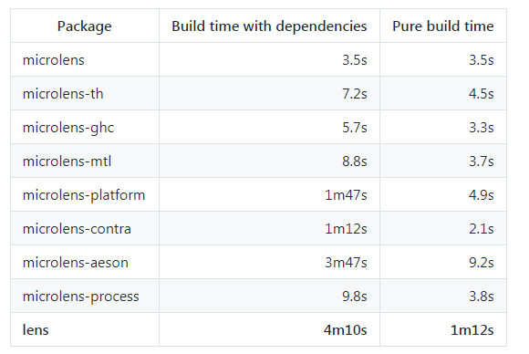

## A Comparison Between Lens Libraries

| **Functions** | **Lens** | **Lens - Simple** | **MicroLens** | **Micro-Lens Platform** |
| --- | --- | --- | --- | --- |
| Basic Functions like
 setter,getter | ✔️ | ✔️ | ✔️ | ✔️ |
| Documentation | ✔️ | **？** | ✔️ | **？** |
| Understandable Implementation a.k.a Source code Cleanliness |  **？**| ✔️ | ❌ | ❌ |
| Independent of Dependencies | ❌ | ❌ | ✔️ | ✔️ |
| Support of Complex structures like Prisms, Isos etc.. | ✔️ | **？** | ❌ | ❌ |
| Size of package | Fat | Medium - rare | Small | Upper portion of small |

Note: microlens has no dependencies starting from GHC 7.10 (base-4.8). Prior to that, it depends on transformers-0.2 or above.

## Conclusion:

- [lens-simple](http://hackage.haskell.org/package/lens-simple) if you specifically want a library with a clean, understandable implementation, even if it&#39;s sometimes more cumbersome to use and can be a bit slower.
- [lens-family](http://hackage.haskell.org/package/lens-family) if you like [lens-simple](http://hackage.haskell.org/package/lens-simple) but don&#39;t want the Template Haskell dependency.
- [lens](http://hackage.haskell.org/package/lens) if you use anything that&#39;s not included in [microlens](http://hackage.haskell.org/package/microlens).(Prisms, Isos,indexed traversals, etc ..)
- [microlens](http://hackage.haskell.org/package/microlens) otherwise.

## Other Similar Lens Libraries:

[basic-lens](http://hackage.haskell.org/package/basic-lens) – the smallest library ever, containing only Lens, view, set, and over (and no lenses whatsoever). Uses only 1 extension – RankNTypes – and thus can be used with e.g. JHC and really old GHCs.

- [reasonable-lens](http://hackage.haskell.org/package/reasonable-lens) – a bigger library which has Lens, some utilities (like view, use, +=), makeLenses even, but little else – no lenses (except for \_1 ... \_4), no Traversal, no documentation. Overall it looks like something slapped together in a hurry by someone who simply needed to get rid of a lens dependency in one of nir projects.

- [lens-simple](http://hackage.haskell.org/package/lens-simple) – a single module re exporting parts of [lens-family](http://hackage.haskell.org/package/lens-family). It&#39;s the most feature-complete library on this list, with both Lens and Traversal available, as well as a number of lenses, traversals, and utilities. However, it has some annoyances – no each, \_1 and \_2 work only on pairs, ix doesn&#39;t work on lists or arrays and is thus useless, at only works on Map, etc. I don&#39;t think these will ever be fixed, as they require defining some ad-hoc typeclasses, and the current absence of any such typeclasses in lens-family seems to suggest that the authors consider it a bad idea.

- [data-lens-light](http://hackage.haskell.org/package/data-lens-light) – a library which uses a different formulation of lenses and is thus incompatible with lens (it uses different names, too). Doesn&#39;t actually provide any lenses.

(Sources:[https://github.com/ekmett/lens](https://github.com/ekmett/lens)  ,[https://github.com/monadfix/microlens](https://github.com/monadfix/microlens) , Hackage pages of the respective packages, Subreddits)
